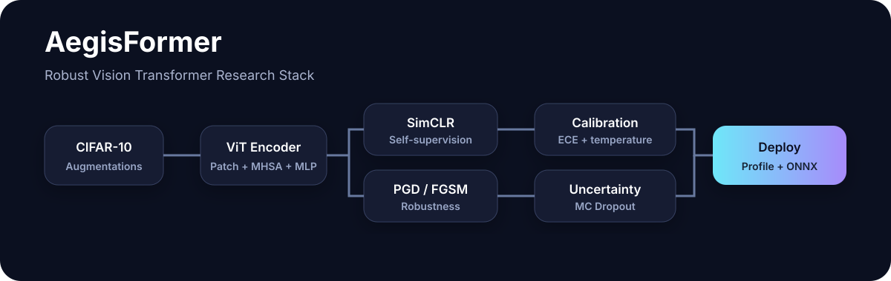

# 🛡️ AegisFormer

<p align="center">
  
</p>

<p align="center">
  <strong>A research-grade Vision Transformer laboratory for robustness, self-supervision, uncertainty, calibration, profiling, and deployment.</strong>
</p>

<p align="center">
  
  
  
  
</p>

---

## Why this repository exists

Most vision repositories answer only one question: **how accurate is the model?**

AegisFormer treats a model as a complete research object. It asks:

- Can the representation be improved with **self-supervised learning**?
- How does the network behave under **adversarial perturbations**?
- Is its confidence **calibrated**?
- Can it estimate **epistemic uncertainty**?
- What do its Transformer attention paths focus on?
- How expensive is it in **parameters, MACs, latency, and throughput**?
- Can the trained model be exported cleanly to **TorchScript or ONNX**?

The result is a compact but serious ML systems project that is useful for research portfolios, reproducible experiments, and hardware-aware extensions.

## Highlights

| Area | Included |
|---|---|
| Architecture | ViT implemented from scratch with patch embedding, MHSA, MLP blocks, stochastic depth |
| Supervised training | AdamW, cosine schedule, warmup, AMP, gradient clipping, label smoothing |
| Regularization | MixUp, CutMix, RandAugment, Random Erasing |
| Self-supervision | SimCLR + NT-Xent contrastive objective |
| Robust ML | FGSM, multi-step PGD, adversarial training |
| Trustworthiness | ECE, Brier score, NLL, temperature scaling |
| Uncertainty | Monte-Carlo dropout, predictive entropy, mutual information |
| Interpretability | Transformer attention rollout |
| Efficiency | Parameter count, estimated MACs, latency, throughput |
| Deployment | TorchScript and ONNX export |
| Engineering | CLI, YAML configs, tests, Docker, Makefile, GitHub Actions |
| Demo | Optional Gradio inference UI |

## Repository structure

```text
AegisFormer/
├── assets/
│   └── architecture.svg
├── configs/
│   ├── baseline.yaml
│   ├── robust.yaml
│   └── simclr.yaml
├── demo/
│   └── app.py
├── scripts/
│   └── smoke_test.py
├── src/aegisformer/
│   ├── models/
│   │   └── vit.py
│   ├── attacks.py
│   ├── calibration.py
│   ├── cli.py
│   ├── config.py
│   ├── data.py
│   ├── evaluate.py
│   ├── export.py
│   ├── losses.py
│   ├── metrics.py
│   ├── pretrain.py
│   ├── profiler.py
│   ├── train.py
│   ├── uncertainty.py
│   └── visualize.py
├── tests/
├── .github/workflows/ci.yml
├── Dockerfile
├── Makefile
├── pyproject.toml
└── README.md
```

## Installation

### 1. Clone

```bash
git clone https://github.com/matinfirooz/AegisFormer.git
cd AegisFormer
```

### 2. Create environment

```bash
python -m venv .venv
source .venv/bin/activate          # Linux/macOS
# .venv\\Scripts\\activate         # Windows PowerShell
```

### 3. Install

```bash
pip install -U pip
pip install -e ".[dev]"
```

For the interactive demo:

```bash
pip install -e ".[demo]"
```

For ONNX tooling:

```bash
pip install -e ".[onnx]"
```

## 60-second smoke test

No dataset download is required for this check.

```bash
python scripts/smoke_test.py
```

It verifies:

1. ViT forward inference
2. PGD attack generation
3. Monte-Carlo dropout uncertainty
4. parameter counting
5. MAC estimation

## Train the baseline ViT

```bash
aegisformer train --config configs/baseline.yaml
```

Checkpoints and history are written to:

```text
runs/baseline/
├── best.pt
├── last.pt
└── history.csv
```

## Robust adversarial training

The robust configuration combines strong augmentation and on-the-fly adversarial examples.

```bash
aegisformer train --config configs/robust.yaml
```

The default threat model is an L-infinity attack with an 8/255 pixel-space budget.

## Self-supervised SimCLR pretraining

```bash
aegisformer pretrain --config configs/simclr.yaml
```

Then transfer the learned encoder into supervised training:

```bash
aegisformer train \
  --config configs/baseline.yaml \
  --pretrained runs/simclr/backbone_last.pt
```

This gives you a clean **pretrain → transfer → evaluate** research pipeline.

## Evaluate accuracy + confidence quality

```bash
aegisformer evaluate \
  --config configs/baseline.yaml \
  --checkpoint runs/baseline/best.pt
```

Example metrics:

```json
{
  "clean_accuracy": 0.91,
  "nll": 0.31,
  "ece": 0.028,
  "brier": 0.14
}
```

The values above are illustrative; your actual results depend on training, hardware, seed, and hyperparameters.

### Temperature calibration

```bash
aegisformer evaluate \
  --config configs/baseline.yaml \
  --checkpoint runs/baseline/best.pt \
  --calibrate
```

Temperature is fitted on the validation split and then applied to the test logits.

## Adversarial evaluation

### FGSM

```bash
aegisformer evaluate \
  --config configs/robust.yaml \
  --checkpoint runs/robust/best.pt \
  --attack fgsm
```

### PGD

```bash
aegisformer evaluate \
  --config configs/robust.yaml \
  --checkpoint runs/robust/best.pt \
  --attack pgd
```

## Uncertainty estimation

AegisFormer provides MC-dropout uncertainty without introducing an ensemble dependency.

```python
from aegisformer.uncertainty import mc_dropout_predict

result = mc_dropout_predict(model, images, passes=30)

probabilities = result["mean_probability"]
entropy = result["predictive_entropy"]
mutual_information = result["mutual_information"]
```

- **Predictive entropy** measures total predictive uncertainty.
- **Mutual information** is useful as an approximation of epistemic/model uncertainty.

## Attention rollout

The custom Transformer blocks can expose per-layer attention maps and compose them across depth.

```python
from aegisformer.visualize import save_attention_rollout

save_attention_rollout(model, images, "runs/attention.png")
```

This produces a patch-level importance map from the class token to the image tokens.

## Hardware-aware profiling

```bash
aegisformer profile --config configs/baseline.yaml --batch-size 1
```

Example output format:

```json
{
  "device": "cuda",
  "parameters": 2788810,
  "macs_estimate": 123456789,
  "latency_ms_mean": 1.84,
  "latency_ms_p50": 1.81,
  "latency_ms_min": 1.73,
  "throughput_img_s": 543.2
}
```

The profiler is intentionally transparent and dependency-light. MAC counts are analytical estimates; measured silicon energy or FPGA resource claims require a hardware tool flow.

## Export for deployment

### TorchScript

```bash
aegisformer export \
  --config configs/baseline.yaml \
  --checkpoint runs/baseline/best.pt \
  --output exports/aegisformer.pt \
  --format torchscript
```

### ONNX

```bash
aegisformer export \
  --config configs/baseline.yaml \
  --checkpoint runs/baseline/best.pt \
  --output exports/aegisformer.onnx \
  --format onnx
```

## Interactive demo

```bash
pip install -e ".[demo]"
python demo/app.py \
  --config configs/baseline.yaml \
  --checkpoint runs/baseline/best.pt
```

## Configuration-first experimentation

Everything important is exposed through YAML rather than hard-coded experiment logic.

```yaml
model:
  patch_size: 4
  embed_dim: 192
  depth: 6
  num_heads: 3
  stochastic_depth: 0.1

train:
  lr: 0.0005
  weight_decay: 0.05
  mixup_alpha: 0.2
  amp: true

robust:
  adversarial_training: false
  epsilon: 0.031372549
  alpha: 0.007843137
  steps: 7
```

That makes ablations easy to reproduce and easy to present in a paper or technical report.

## Suggested research experiments

AegisFormer becomes much more interesting when used as an experimental platform. Strong extensions include:

- clean accuracy vs. PGD robustness Pareto curves
- calibration before and after adversarial training
- SimCLR initialization vs. random initialization
- uncertainty under distribution shift
- patch size vs. latency/accuracy trade-offs
- low-bit or fake-quantized attention/MLP blocks
- approximate arithmetic injection into linear layers
- structured token pruning
- attention entropy vs. adversarial vulnerability
- ONNX/TensorRT deployment benchmarking

## Reproducibility

The project seeds Python, NumPy, and PyTorch. Every training run records:

- the YAML configuration
- epoch-level metrics
- last checkpoint
- best validation checkpoint

For a publication-quality study, repeat runs over multiple seeds and report mean ± standard deviation.

## Testing

```bash
pytest -q
```

Lint:

```bash
ruff check src tests scripts
```

Or run both through the Makefile:

```bash
make test
make lint
```

## Docker

```bash
docker build -t aegisformer .
docker run --rm aegisformer
```

The default container command runs the model profiler.

## Roadmap

- [x] ViT from scratch
- [x] supervised training
- [x] MixUp / CutMix
- [x] SimCLR pretraining
- [x] FGSM / PGD attacks
- [x] adversarial training
- [x] ECE / Brier / NLL
- [x] temperature scaling
- [x] MC-dropout uncertainty
- [x] attention rollout
- [x] latency + MAC profiling
- [x] TorchScript + ONNX export
- [x] Gradio demo
- [x] unit tests + CI
- [ ] CIFAR-100 / Tiny-ImageNet
- [ ] quantization-aware training
- [ ] token pruning
- [ ] TensorRT benchmarking
- [ ] accelerator-oriented per-layer operation trace

## Citation

If you build research on top of this repository, you can use the following placeholder until a formal release is available:

```bibtex
@software{firoozbakht2026aegisformer,
  author  = {Matin Firoozbakht},
  title   = {AegisFormer: A Research Stack for Robust and Trustworthy Vision Transformers},
  year    = {2026},
  url     = {https://github.com/matinfirooz/AegisFormer}
}
```

## License

MIT License. See [LICENSE](LICENSE).

---

<p align="center">
  Built for experiments where <strong>accuracy is only the beginning</strong>.
</p>
